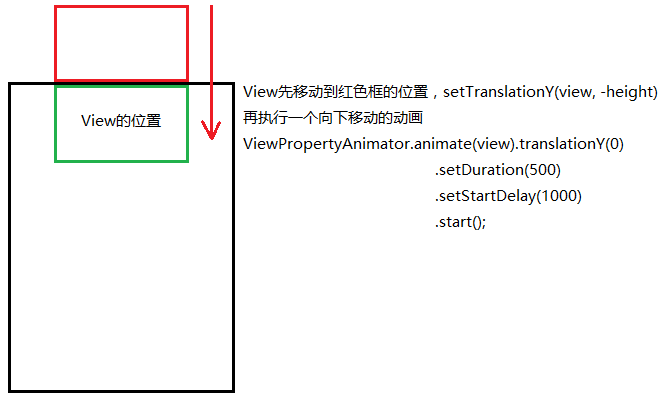
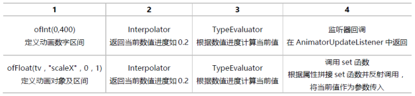
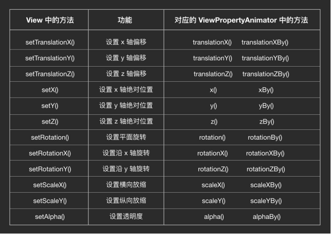

## 概述
常用的View属性成员

| 属性                        | 描述                                       |
| ------------------------- | ---------------------------------------- |
| translationX，translationY | 控制View的位置，值是相对于View容器左上角坐标的偏移。           |
| rotationX，rotationY       | 控制相对于轴心旋转。                               |
| x，y                       | 控制View在容器中的位置，即左上角坐标加上translationX和translationY的值。 |
| alpha                     | 控制View对象的alpha透明度值。                      |

补间动画，早期的补间动画绘制出来的效果其实并没有真正改变View的属性，只是系统临时绘制出来的效果
属性动画:3.0之后谷歌提出，属性动画就是用新增的属性(如translationX，translationY，scaleX，scaleY，rotation，rotationX，rotationY等等)用来记录View的改变的值；这样就允许动画能保存并持续进行。

| class                | 描述                                       |
| -------------------- | ---------------------------------------- |
| ValueAnimator        | 动画的执行类，只是帮你定义和执行动画流程，并没有实现任何的动画逻辑，需要你添加动画更新的监听，在执行过程中进行自定义的动画逻辑 |
| ObjectAnimator       | ValueAnimator的子类                         |
| ViewPropertyAnimator | View动画的执行类                               |
| AnimatorInflater     | 用户加载属性动画的xml文件                           |
| AnimatorSet          | 动画集合                                     |
| PropertyValuesHolder | 设置属性和属性对应的值                              |
| Keyframe             | 关键帧                                      |
| TypeEvaluator        | 类型估值，主要用于设置动画操作属性的值。                     |
| TimeInterpolator     | 时间插值，子接口Interpolator                     |

新的属性

| 属性           | 描述                |
| ------------ | ----------------- |
| translationX | setTranslationX() |
| translationY | setTranslationY() |
| rotation     | setRotation()     |
| scaleX       | setScaleX()       |

设置属性动画值后，view的l，t，r，b的值没有改变，调用layout()方法的时候，view的l，t，r，b的值才会改变



## ValueAnimator
ValueAnimator只是对值做动画运算，而不是针对控件的，我们需要监听ValueAnimator的动画过程来自己对控件做操作

### 常用方法

| 方法声明                     | 功能描述      |
| ------------------------ | --------- |
| ofFloat()                | 创建实例      |
| setInterpolator()        | 设置插值器     |
| setEvaluator()           | 设置估值器     |
| addUpdateListener()      | 监听动画的过程   |
| addListener()            | 监听动画的开始结束 |
| setStartDelay()          | 设置延时执行时间  |
| setRepeatCount()         | 设置重复执行次数  |
| setRepeatMode()          | 设置重复执行模式  |
| setDuration()            | 设置持续时间    |
| getAnimatedFraction()    | 获取动画执行进度  |
| getAnimatedValue()       | 获取当前运动点的值 |
| ofPropertyValuesHolder() |           |

```java
ValueAnimator animator = ValueAnimator.ofFloat(1.0f);
animator.setInterpolator(new LinearInterpolator());
animator.addUpdateListener(new ValueAnimator.AnimatorUpdateListener() {
    @Override
    public void onAnimationUpdate(ValueAnimator animation) {
        float fraction = animation.getAnimatedFraction();
		float currentValue = animation.getAnimatedValue();
    }
});

animator.addListener(new AnimatorListenerAdapter() {
    @Override
    public void onAnimationEnd(Animator animation) {
        super.onAnimationEnd(animation);
    }
});

animator.setStartDelay(1000);
animator.setRepeatCount(2);
animator.setRepeatMode(Animation.REVERSE);
animator.setDuration(1000).start();
```

2.2. 监听器

```java
/**
 * 监听器一：监听动画变化时的实时值 
 */
public static interface AnimatorUpdateListener {
    void onAnimationUpdate(ValueAnimator animation);
}
//添加方法为：public void addUpdateListener(AnimatorUpdateListener listener)  
/**
 * 监听器二：监听动画变化时四个状态 
 */
public static interface AnimatorListener {
    void onAnimationStart(Animator animation);
    void onAnimationEnd(Animator animation);
    void onAnimationCancel(Animator animation);
    void onAnimationRepeat(Animator animation);
}
//添加方法为：public void addListener(AnimatorListener listener) 
```

## ObjectAnimator




ObjectAnimator内部的工作机制是通过寻找特定属性的get和set方法，然后通过方法不断地对值进行改变，从而实现动画效果的。

| 方法声明                     | 功能描述  |
| ------------------------ | ----- |
| ofInt()                  |       |
| ofFloat()                |       |
| ofArgb()                 | 5.0新增 |
| ofObject()               |       |
| ofPropertyValuesHolder() |       |
| setRepeatMode()          |       |
| setRepeatCount()         |       |
| setDuration()            |       |
| setEvaluator()           |       |
| addUpdateListener()      |       |

```java
ObjectAnimator translation = ObjectAnimator.ofFloat(view, View.TRANSLATION_X, 0,100);
ObjectAnimator scale = ObjectAnimator.ofFloat(view, View.SCALE_X, 0.5f);
ObjectAnimator alpha = ObjectAnimator.ofFloat(view, View.ALPHA, 1f, 0f, 1f);
ObjectAnimator rotate = ObjectAnimator.ofFloat(view, View.ROTATION, 90f);
rotate.setRepeatMode(Animation.INFINITE);//无限循环
rotate.setRepeatCount(2);
rotate.setDuration(5000).start();
```

propertyName

| 属性                 | 功能描述         |
| ------------------ | ------------ |
| View.TRANSLATION_X |              |
| View.TRANSLATION_Y |              |
| View.SCALE_X       |              |
| View.SCALE_Y       |              |
| View.ALPHA         |              |
| View.ROTATION      | 绕着控件中心点顺时针旋转 |
| View.ROTATION_X    | 绕着控件的X 轴旋转   |
| View.ROTATION_Y    | 绕着控件的Y 轴旋转   |

设置基准线

- view.setPivotX(); 
- view.setPivotY(); 
- view.invalidate();

```java
public void rotateyAnimRun ( final View view)
{   //一个动画更改多个效果
    ObjectAnimator anim = ObjectAnimator.ofFloat(view, "anim", 1.0F, 0.0F).setDuration(500);
    anim.start();
    anim.addUpdateListener(new AnimatorUpdateListener() {
        @Override
        public void onAnimationUpdate(ValueAnimator animation) {
            float cVal = (Float) animation.getAnimatedValue();
            view.setAlpha(cVal);
            view.setScaleX(cVal);
            view.setScaleY(cVal);
        }
    });
}
```

## ViewPropertyAnimator
| 方法声明              | 功能描述       |
| ----------------- | ---------- |
| view.animate()    | 获取对象       |
| translationX()    | 水平移动       |
| translationY()    | 垂直移动       |
| translationXBy()  | 相对位移       |
| translationYBy()  | 相对位移       |
| scaleX()          |            |
| scaleY()          |            |
| rotation()        |            |
| rotationBy()      | 相对旋转       |
| alpha()           |            |
| setInterpolator() |            |
| withStartAction() | 在动画前执行一些操作 |
| withEndAction()   | 在动画后执行一些操作 |

```java
ViewPropertyAnimator.alpha().withLayer()

ViewPropertyAnimator anim = view.animate();
anim.translationX(1).alpha(0).rotation(45).scaleX(0.5f).
        setInterpolator(new OvershootInterpolator()).
        withStartAction(runnable).withEndAction(runnable).start();
```



## AnimatorInflater

Animator animator = AnimatorInflater.loadAnimator(R.anim.xx);
animator.setTarget(view);
animator.start();

## AnimatorSet
playSequentially()	依次执行动画
playTogether()	同时执行
setTarget()	
setStartDelay()	
AnimatorSet.Builder  play()	

```java
AnimatorSet set = new AnimatorSet();
set.playSequentially(anim1,anim2);
set.playTogether(anim1,anim2);
set.setTarget(view);
set.play(anim1).with(anim2);
set.play(anim3).after(anim2);
set.play(anim4).before(anim1);
set.setStartDelay(long startDelay);
```

6.1. AnimatorSet.Builder
自由设置动画顺序with()，before()，after(long delay)，after(Animator anim)
6.2. AnimatorListener
addListener(AnimatorListener listener);
6.3. 如何实现无限循环动画
playTogether和playSequentially只是负责指定什么时候开始动画，不干涉动画自己的运行过程

## PropertyValueHolder
保存了动画过程中所需要操作的属性和对应的值，同时在一个动画中改变多个属性。

```java
public void propertyValuesHolder (View view)
{
    PropertyValuesHolder pvhX = PropertyValuesHolder.ofFloat("alpha", 1f, 0f, 1f);
    PropertyValuesHolder pvhY = PropertyValuesHolder.ofFloat("scaleX", 1f, 0, 1f);
    PropertyValuesHolder pvhZ = PropertyValuesHolder.ofFloat("scaleY", 1f, 0, 1f);
    ObjectAnimator.ofPropertyValuesHolder(view, pvhX, pvhY, pvhZ)
.setDuration(1000).start();
}
```

7.1. 常用函数
把同一个属性拆分
```java
public static PropertyValuesHolder ofKeyframe(String propertyName, Keyframe... values)
```
propertyName
动画所要操作的属性名
values
Keyframe的列表，PropertyValuesHolder会根据每个Keyframe的设定，定时将指定的值输出给动画。

```java
/**
 * 设置动画的Evaluator 
 */
public void setEvaluator(TypeEvaluator evaluator)
/**
 * 用于设置ofFloat所对应的动画值列表 
 */
public void setFloatValues(float... values)
/**
 * 用于设置ofInt所对应的动画值列表 
 */
public void setIntValues(int... values)
/**
 * 用于设置ofKeyframe所对应的动画值列表 
 */
public void setKeyframes(Keyframe... values)
/**
 * 用于设置ofObject所对应的动画值列表 
 */
public void setObjectValues(Object... values)
/**
 * 设置动画属性名 
 */
public void setPropertyName(String propertyName)
```

## Keyframe
关键帧，一个关键帧必须包含两个原素，第一时间点，第二位置。可以实现插值器interpolater和估值器evaluator的功能

```java
public static Keyframe ofFloat(float fraction, float value)
```

- fraction:表示当前的显示进度，即从加速器中getInterpolation()函数的返回值
- value:表示当前应该在的位置

### 常用函数

```java
/**
 * 设置fraction参数，即Keyframe所对应的进度 
 */
public void setFraction(float fraction)
/**
 * 设置当前Keyframe所对应的值 
 */
public void setValue(Object value)
/**
 * 设置Keyframe动作期间所对应的插值器 
 */
public void setInterpolator(TimeInterpolator interpolator)
```

## Interpolator

插值器就是用来控制动画区间的值被如何计算出来的。插值器的意义其实就相当于物理公式中的加速度参数。过渡值变化的规则
Interpolator插补器：控制动画的变化速率，系统默认的Interpolator其实就是一个先加速后减速的Interpolator
根据时间的完成度计算出对应的动画完成度


### TimeInterpolator
```java
public interface TimeInterpolator {
    float getInterpolation(float input);
}
```

- 动画进度
  参数input:input参数是一个float类型，它取值范围是0到1，表示当前动画的进度，取0时表示动画刚开始，取1时表示动画结束，取0.5时表示动画中间的位置，其它类推。

- 数值进度
  返回值：表示当前实际想要显示的进度。取值可以超过1也可以小于0，超过1表示已经超过目标值，小于0表示小于开始位置。

### 自定义插值器
LinearInterpolator实现了Interpolator接口；而Interpolator接口则直接继承自TimeInterpolator，而且并没有添加任何其它的方法。

```java
public class MyInterploator implements TimeInterpolator {
    @Override
    public float getInterpolation(float input) {
        return 1-input;
    }
}
```

## TypeEvaluator 
TypeEvaluator告诉动画系统如何从初始值过度到结束值，估值器/转换器
Evaluator就是将从加速器返回的数值进度转成对应的数字值
Evaluator其实就是一个转换器，他能把小数进度转换成对应的数值位置

```java
public class FloatEvaluator implements TypeEvaluator<Number> {
    public Float evaluate(float fraction, Number startValue, Number endValue) {
        float startFloat = startValue.floatValue();
        return startFloat + fraction * (endValue.floatValue() - startFloat);
    }
```

- Fraction:fraction就是加速器中的返回值，表示当前动画的数值进度，百分制的小数表示。
- startValue:对应ofInt(int start,int end)中的start数值
- endValue:对应ofInt(int start,int end)中的end数值

PointFEvaluator 5.0新增

### 自定义转换器

```java
public class MyEvaluator implements TypeEvaluator<Integer> {
    @Override
    public Integer evaluate(float fraction, Integer startValue, Integer endValue) {
        int startInt = startValue;
        return (int)(200+startInt + fraction * (endValue - startInt));
    }
}  
```

### ArgbEvaluator
颜色渐变的动画

### set，get函数
ObjectAnimator做动画，并不是根据控件xml中的属性来改变的，而是通过指定属性所对应的set方法来改变的。
当且仅当动画的只有一个过渡值时，系统才会调用对应属性的get函数来得到动画的初始值

```java
//1、透明度：alpha  
public void setAlpha(float alpha)

//2、旋转度数：rotation、rotationX、rotationY  
public void setRotation(float rotation)
public void setRotationX(float rotationX)
public void setRotationY(float rotationY)

//3、平移：translationX、translationY  
public void setTranslationX(float translationX)
public void setTranslationY(float translationY)

//4、缩放：scaleX、scaleY  
public void setScaleX(float scaleX)
public void setScaleY(float scaleY)
```

## AnimationUtils

```xml
<?xml version="1.0" encoding="utf-8"?>
<translate xmlns:android="http://schemas.android.com/apk/res/android"
           android:duration="1000"
           android:fromXDelta="0"
           android:interpolator="@anim/cycle_7"
           android:toXDelta="10"/>

anim/cycle_7.xml
<?xml version="1.0" encoding="utf-8"?>
<cycleInterpolator xmlns:android="http://schemas.android.com/apk/res/android"
                   android:cycles="7"/>
```

```java
Animation shake = AnimationUtils.loadAnimation(this, R.anim.shake);
shake.setInterpolator();
view.startAnimation(shake);

Animation animation = AnimationUtils.loadAnimation(context, R.anim.xx);
animation. setAnimationListener();
AnimationUtils.showAlpha(view);
AnimationUtils.hideAlpha(view);
```

## Animation.AnimationListener

```java
anim.addListener(new AnimatorListener() {
    @Override
    public void onAnimationStart(Animator animation) {
    }
    @Override
    public void onAnimationRepeat(Animator animation) {
    }
    @Override
    public void onAnimationEnd(Animator animation) {
    }
    @Override
    public void onAnimationCancel(Animator animation) {
    }
});

anim.addListener(new AnimatorListenerAdapter() {
    @Override
    public void onAnimationEnd(Animator animation) {
    }
});
```

## View
方法声明	功能描述
setAlpha()	设置透明度
setTranslationX()	
setTranslationY()	
setX()	
setY()	
setScaleX()	
setScaleY()	
setRotation()	
setRotationX()	
setRotationY()	

## XML实现
<animator />：对应ValueAnimator
<objectAnimator />：对应ObjectAnimator
<set />：对应AnimatorSet
AnimatorInflater.loadAnimator() 加载

### 如何求对应角度的sin,cos值

```java
/**
 * 求对应弧度的正弦值
 */
double sin(double d)
/**
 * 求对应弧度的余弦值
 */
double cos(double d)
/**
 * 求对应弧度的正切值
 */
double tan(double d)
/**
 * Math中根据度数得到弧度值的函数
 */
double toRadians(double angdeg)
/**
 * 90度的正弦值
 */
Math.sin(Math.PI/2)
```