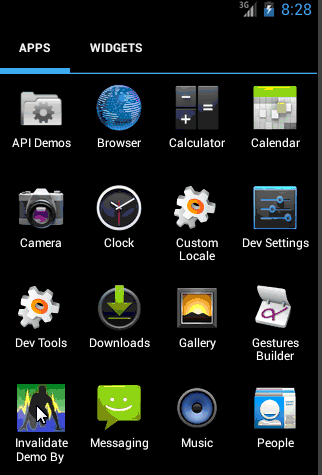
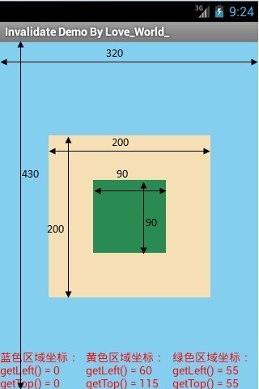
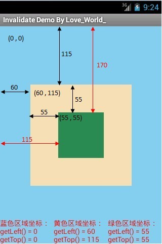
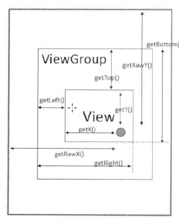
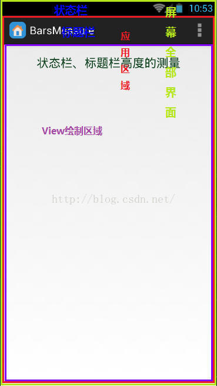

## Android View的getLeft()、getRight()、getTop()、getBottom()

> 原文链接：http://www.cnblogs.com/zhengbeibei/archive/2013/05/07/3065999.html

### 引起疑惑

分析视图invalidate流程的过程中发现view的left， right， top， bottom跟自己理解的不一样，现在想分析一下这几个值具体的含义



### 理解Android坐标，位置概念

坐标系在二维视图中通过X轴和Y轴两个数字为组合表示某个点的绝对坐标。 例如(30, 100) 通常表示X轴30， Y轴100交叉的一个点。   在Android中以左上角为原点（0,0），水平方向是X轴，从左到右，垂直方向是Y轴，从上到下，可以把left相当于X轴值， top相当于Y轴值， 通过这两个值Android系统可以知道视图的绘制起点，在通过Wdith 和 Height 可以得到视图上下左右具体值，就可以在屏幕上绝对位置绘制视图。right 与 bottom计算如下：

```
right = left + width;
bottom = top + height;
```

### View中相应API

```java
view.getLeft();//表示的是view左侧以其父View的左上角为原点的水平坐标位置
view.getRight();//表示的view右侧以其父View的左上角为原点的水平坐标位置
view.getTop();//表示的是view顶部以父View的左上角为原点的垂直坐标位置
view.getBottom();//表示的是view底部以父View的左上角为原点的垂直坐标位置
view.getWidth();//表示view宽度
view.getHeight();//表示view高度
```

### 实例分析



按照我的理解：

蓝色区域位置 left = 0，   top = 0         坐标(0, 0 )

黄色区域位置 left = 60， top = 115    坐标(60, 115) 

绿色区域位置 left = 115， top = 170  坐标(115, 170)   

绿色区域，这里理解错误，我认为绿色区域的位置是针对于蓝色区域的(0, 0)坐标的值，从上图的右下角打印出的坐标值就可以看出与下方我列出的值不一致，看看下面的图就明白了



总结： 视图的left ， top ， right ， bottom 的值是针对其父视图的相对位置， 绿色区域是针对其父视图(即黄色区域为(0, 0)点)的坐标，不应该是(115, 170 ) 而是 (55, 55)

### 获取坐标值的各种方法



## 你真的了解View的坐标吗？

> 原文链接：http://blog.csdn.net/gdutxiaoxu/article/details/53700020

### 闲聊

View，对我们来说在熟悉不过了，从接触Android开始，我们就一直在接触View，界面当中到处都是 View，比如我们经常用到的TextView，Button，LinearLayout等等，但是我们真的了解View吗？尤其是View的坐标。

mLeft,mRight,mY,mX,mTranslationY,mScoollY,相对于屏幕的坐标等等这些概念你真的清楚了吗？如果真的清楚了，那你没有必要度这篇博客，如果你还是有一些模糊，建议花上几分钟的时间读一下，这篇博客较短，花个几分钟的时间就可以阅读完。

### 为什么要写这一篇博客呢？

因为掌握View的坐标很重要，尤其是对于自定义View，学习动画有重大的意义。

这篇博客主要讲解一下问题

- View 的 getLeft()和get Right()和 getTop() 和getBottom()
- View 的 getY()， getTranslationY() 和 getTop() 之间的联系
- View 的 getScroolY 和 View 的 scrollTo() 和 scrollBy()
- event.getY 和 event.getRawY()
- 扩展，怎样获取状态栏（StatusBar）和标题栏（titleBar）的高度

### 基本概念



简单说明一下（上图Activity采用默认Style，状态栏和标题栏都会显示）：最大的草绿色区域是屏幕界面，红色次大区域我们称之为“应用界面区域”，最小紫色的区域我们称之为“View绘制区域”；屏幕顶端、应用界面区之外的那部分显示手机电池网络运营商信息的为“状态栏”，应用区域顶端、View绘制区外部显示Activity名称的部分我们称为“标题栏”。

从这张图片我们可以看到，在Android中，当ActionBar存在的情况下，

```
屏幕的高度=状态栏+应用区域的高度=状态栏的高度+（标题栏的高度+View绘制区域的高度）
```

当ActionBar不存在的情况下

```
屏幕的高度=状态栏+应用区域的高度=状态栏的高度+（View绘制区域的高度）
```

### View 的 getLeft()和getRight()和 getTop() 和getBottom()

```java
View.getLeft() ;
View.getTop() ;
View.getBottom();
View.getRight() ;
```

top是左上角纵坐标，left是左上角横坐标，right是右下角横坐标，bottom是右下角纵坐标,都是相对于它的**直接父View**而言的，而不是相对于**屏幕**而言的。这一点要区分清楚。那那个坐标是相对于屏幕而言的呢，以及要怎样获取相对于屏幕的坐标呢？

目前View里面的变量还没有一个是相对于屏幕而言的，但是我们可以获取到相对于屏幕的坐标。一般来说，我们要获取View的坐标和高度 等，都必须等到View绘制完毕以后才能获取的到，在Activity 的 onCreate()方法 里面 是获取不到的，必须 等到View绘制完毕以后才能获取地到View的响应的坐标，一般来说，主要 有以下两种方法。

第一种方法，onWindowFocusChanged()方法里面进行调用

```java
@Override
public void onWindowFocusChanged(boolean hasFocus) {
  super.onWindowFocusChanged(hasFocus); 
  //确保只会调用一次
   if(first){
     first=false;
     final int[] location = new int[2];     
     mView.getLocationOnScreen(location);
     int x1 = location[0]  ;
     int y1 = location[1]  ;
     Log.i(TAG, "onCreate: x1=" +x1);
     Log.i(TAG, "onCreate: y1=" +y1);
   }
}
```

第二种方法，在视图树绘制完成的时候进行测量

```java
mView.getViewTreeObserver().addOnGlobalLayoutListener(new ViewTreeObserver
        .OnGlobalLayoutListener() {

    @Override
    public void onGlobalLayout() {
        //   移除监听器，确保只会调用一次，否则在视图树发挥改变的时候又会调用
        mView.getViewTreeObserver().removeGlobalOnLayoutListener(this);
        final int[] location = new int[2];
        mView.getLocationOnScreen(location);
        int x1 = location[0];
        int y1 = location[1];
        Log.i(TAG, "onCreate: x1=" + x1);
        Log.i(TAG, "onCreate: y1=" + y1);
    }
});
```

### View的getY()，getTranslationY() 和 getTop() 之间的联

**getY()**

> Added in API level 14
> The visual y position of this view, in pixels.(返回的是View视觉上的图标，即我们眼睛看到位置的Y坐标，默认值跟getTop()相同，别急，下面会解释）

**getTranslationY()**

> Added in API level 14
> The vertical position of this view relative to its top position, in pixels.(竖直方向上相对于top的偏移量，默认值为0）

那 getY() 和 getTranslationY() 和 getTop () 到底有什么关系呢？

```java
@ViewDebug.ExportedProperty(category = "drawing")
public float getY() {
   return mTop + getTranslationY();
}

@ViewDebug.ExportedProperty(category = "drawing")
public float getTranslationY() {
    return mRenderNode.getTranslationY();
}

@ViewDebug.CapturedViewProperty
public final int getTop() {
    return mTop;
}
```

从以上的源码我们可以知道 getY()= getTranslationY()+ getTop ()，而 getTranslationY() 的默认值是0，除非我们通过 setTranlationY() 来改变它，这也就是我们上面上到的 getY 默认值跟 getTop()相同

那我们要怎样改变 top值 和 Y 值呢？ 很明显就是调用相应的set方法 ，即 setY() 和setTop() ，就可以改变他们 的值。

### View的getScroolY() 和 View 的 scrollTo() 和 scrollBy()

getScrollY是一个比较特别的函数，因为它涉及一个值叫mScrollY，简单说，getScrollY一般得到的都是0，除非你调用过scrollTo或scrollBy这两个函数来改变它。

#### scrollTo() 和 scrollBy()

从字面意思我们可以知道 scrollTo() 是滑动到哪里的意思 ，scrollBy()是相对当前的位置滑动了多少。当然这一点在源码中也是可以体现出来的

```java
public void scrollTo(int x, int y) {
    if (mScrollX != x || mScrollY != y) {
        int oldX = mScrollX;
        int oldY = mScrollY;
        mScrollX = x;
        mScrollY = y;
        invalidateParentCaches();
        onScrollChanged(mScrollX, mScrollY, oldX, oldY);
        if (!awakenScrollBars()) {
            postInvalidateOnAnimation();
        }
    }
}

public void scrollBy(int x, int y) {
    scrollTo(mScrollX + x, mScrollY + y);
}
```

有几点需要注意的是

- 不论是scrollTo或scrollBy，其实都是对View的内容进行滚动而不是对View本身，你可以做个小实验，一个LinearLayouy背景是黄色，里面放置一个子LinearLayout背景是蓝色，调用scrollTo或scrollBy，移动的永远是蓝色的子LinearLayout。
- 还有就是scrollTo和scrollBy函数的参数和坐标系是“相反的”，比如scrollTo(-100,0)，View的内容是向X轴正方向移动的，这个相反打引号是因为并不是真正的相反，具体可以看源码，关于这两个函数的源码分析大家可以看[Android——源码角度分析View的scrollBy()和scrollTo()的参数正负问题](http://blog.csdn.net/xplee0576/article/details/24242383?utm_source=tuicool&utm_medium=referral)，一目了然。

### View 的 width 和 height

```java
@ViewDebug.ExportedProperty(category = "layout")
public final int getHeight() {
    return mBottom - mTop;
}
```

我们可以看到 Android的 height 是由 mBottom 和 mTop 共同得出的，那我们要怎样设置Android的高度呢？有人会说直接在xml里面设置 android:height="" 不就OK了，那我们如果要动态设置height的高度呢，怎么办？你可能会想到 setWidth()方法？但是我们找遍了View的所有方法，都没有发现 setWidth()方法，那要怎样动态设置height呢？其实有两种方法

```java
int width=50;
int height=100;
ViewGroup.LayoutParams layoutParams = view.getLayoutParams();
if(layoutParams==null){
    layoutParams=new ViewGroup.LayoutParams(width,height);
}else{
    layoutParams.height=height;
}
view.setLayoutParams(layoutParams);
```

第二种方法，单独地改变top或者bottom的值，这种方法不推荐使用

至于width，它跟height基本一样，只不过它是有mRight 和mLeft 共同决定而已。

需要注意的是，平时我们在执行动画的过程，不推荐使用LayoutParams来改变View的状态，因为改变LayoutParams会调用requestLayout()方法，会标记当前View及父容器，同时逐层向上提交，直到ViewRootImpl处理该事件，ViewRootImpl会调用三大流程，从measure开始，对于每一个含有标记位的view及其子View都会进行测量、布局、绘制，性能较差，源码体现如下：关于requestLayout ()方法的更多分析可以查看这一篇博客[Android View 深度分析requestLayout、invalidate与postInvalidate](http://blog.csdn.net/a553181867/article/details/51583060)

```java
public void setLayoutParams(ViewGroup.LayoutParams params) {
    if (params == null) {
        throw new NullPointerException("Layout parameters cannot be null");
    }
    mLayoutParams = params;
    resolveLayoutParams();
    if (mParent instanceof ViewGroup) {
        ((ViewGroup) mParent).onSetLayoutParams(this, params);
    }
    requestLayout();
}
```

因此我们如果在api 14 以后 ，在动画执行过程中，要改变View的状态，推荐使用setTranslationY()和setTranslationX（0等方法，而 尽量避免改变LayoutParams.因为性能嫌贵来说较差。

### event.getY() 和 event.getRawY()

要区分于MotionEvent.getRawX() 和MotionEvent.getX();,

在public boolean onTouch(View view, MotionEvent event) 中，当你触到控件时，x,y是相对于该控件左上点（控件本身）的相对位置。 而rawx,rawy始终是相对于屏幕的位置。getX()是表示Widget相对于自身左上角的x坐标,而getRawX()是表示相对于屏幕左上角的x坐标值 (注意:这个屏幕左上角是手机屏幕左上角,不管activity是否有titleBar或是否全屏幕)。


### 扩展，怎样获取状态栏（StatusBar）和标题栏（titleBar）的高度

```java
public void onWindowFocusChanged(boolean hasFocus) {
    super.onWindowFocusChanged(hasFocus);

    //屏幕
    DisplayMetrics dm = new DisplayMetrics();
    getWindowManager().getDefaultDisplay().getMetrics(dm);
    Log.e(TAG, "屏幕高:" + dm.heightPixels);

    //应用区域
    Rect outRect1 = new Rect();
    getWindow().getDecorView().getWindowVisibleDisplayFrame(outRect1);
    //这个也就是状态栏的高度
    Log.e(TAG, "应用区顶部" + outRect1.top);
    Log.e(TAG, "应用区高" + outRect1.height());

    //这个方法必须在有actionBar的情况下才能获取到状态栏的高度
    //View绘制区域
    Rect outRect2 = new Rect();
    getWindow().findViewById(Window.ID_ANDROID_CONTENT).getDrawingRect(outRect2);
  	//不能像上边一样由outRect2.top获取，这种方式获得的top是0，可能是bug吧
    Log.e(TAG, "View绘制区域顶部-错误方法：" + outRect2.top);
    Log.e(TAG, "View绘制区域高度：" + outRect2.height());

    int viewTop = getWindow().findViewById(Window.ID_ANDROID_CONTENT).getTop();//要用这种方法
    Log.e(TAG, "View绘制区域顶部-正确方法：" + viewTop);

    int titleBarHeight=viewTop;
    Log.d(TAG, "onWindowFocusChanged: 标题栏高度titleBarHeight=" +titleBarHeight);
}
```

这里我们需要注意的 是在ActionBar存在的情况下，通过这种方法我们才能够得出titleBar的高度，否则是无法得到的，因为viewTop 为0.

这篇博客到此为止，关于更多自定义View 的一些例子，可以看我以下的博客

- [常用的自定义View例子一(FlowLayout)](http://blog.csdn.net/gdutxiaoxu/article/details/51765428)
- [自定义View常用例子二（点击展开隐藏控件，九宫格图片控件）](http://blog.csdn.net/gdutxiaoxu/article/details/51772308)
- [常用的自定义View例子三（MultiInterfaceView多界面处理）](http://blog.csdn.net/gdutxiaoxu/article/details/51804844)
- [常用的自定义控件四（QuickBarView）](http://blog.csdn.net/gdutxiaoxu/article/details/51804865)

## 源码角度分析View的scrollBy()和scrollTo()的参数正负问题

> 原文链接：http://blog.csdn.net/xplee0576/article/details/24242383

### 为什么要写这篇博客？

以前在使用View的scrollBy()或者scrollTo()的时候，发现它们的参数在正的时候是反方向移动，负的时候是正方向移动。于是就google了下，发现好多博客都要么是转摘、要么是直接抄袭然后美起名曰原创，更恶劣的是这些博文由于是转摘抄袭的关系，竟然都说View在scrollBy()或者scrollTo()的时候，它们的直角坐标系是相反的，这明显是一个错误的观念。
好了，废话不多说进入正题。

### Android设备平面直角坐标系

在做分析之前，首先要建立起Android设备屏幕的平面直角坐标系概念。在Android手机中，屏幕的直角坐标系概念简单来说：
屏幕左上角为直角坐标系的原点(0,0)
从原点出发向左为X轴负方向，向右为X轴正方向
从原点出发向上为Y轴负方向，向下为Y轴正方向

上述概念可通过如下图总结：


在Android中，我们通常说View在屏幕上的坐标，其实就是view的左上的坐标。调用View的invalidate()方法会促使View重绘。
View的scrollBy()和scrollTo()

在分析scrollBy()和scrollTo()之前，先上一段源码片段：

```java
/** 
 * Set the scrolled position of your view. This will cause a call to 
 * {@link #onScrollChanged(int, int, int, int)} and the view will be 
 * invalidated. 
 * @param x the x position to scroll to 
 * @param y the y position to scroll to 
 */  
public void scrollTo(int x, int y) {  
    if (mScrollX != x || mScrollY != y) {  
        int oldX = mScrollX;  
        int oldY = mScrollY;  
        mScrollX = x;  
        mScrollY = y;  
        invalidateParentCaches();  
        onScrollChanged(mScrollX, mScrollY, oldX, oldY);  
        if (!awakenScrollBars()) {  
            invalidate(true);  
        }  
    }  
}  
  
/** 
 * Move the scrolled position of your view. This will cause a call to 
 * {@link #onScrollChanged(int, int, int, int)} and the view will be 
 * invalidated. 
 * @param x the amount of pixels to scroll by horizontally 
 * @param y the amount of pixels to scroll by vertically 
 */  
public void scrollBy(int x, int y) {  
    scrollTo(mScrollX + x, mScrollY + y);  
}  
```
### scrollBy()和scrollTo()的滚动不同点

scrollTo(x, y)：通过invalidate使view直接滚动到参数x和y所标定的坐标
scrollBy(x, y)：通过相对于当前坐标的滚动。从上面代码中，很容以就能看出scrollBy()的方法体只有调用scrollTo()方法的一行代码，scrollBy()方法先对属性mScollX加上参数x和属性mScrollY加上参数y，然后将上述结果作为参数传入调用方法scrollTo()

### scrollBy()和scrollTo()的参数正负影响滚动问题

scrollBy()和scrollTo()在参数为负的时候，向坐标轴正方向滚动；当参数为正的时候，向坐标轴负方向滚动。而作为我们的认知，应该是参数为负的时候，向坐标轴负方向滚动；当参数为正的时候，向坐标轴正方向滚动。
那为什么这两个方法传入参数和引起的滚动方向和我们平常的认知不同呢？
下面就让我们带着这个问题跟随源码分析。如果不想从它的执行过程一步步的去分析，可以直接看本文的最后一段源码。

### 源码执行过程分析

因为scrollBy(x, y)方法体只有一行，并且是调用scrollTo(x, y)，所以我们只要通过scrollTo(x, y)来进行分析就可以了。
在scrollTo(x, y)中，x和y分别被赋值给了mScrollX和mScrollY，最后调用了方法invalidate(true)。貌似到了这里就无路可走了，其实不然，我们知道invalidate这个方法会通知View进行重绘。
那么接下来，我们就可以跳过scrollTo(x, y)去分析View的draw()方法了。照例，在分析onDraw方法之前上一段源码片段：

```java
/** 
 * Manually render this view (and all of its children) to the given Canvas. 
 * The view must have already done a full layout before this function is 
 * called.  When implementing a view, implement 
 * {@link #onDraw(android.graphics.Canvas)} instead of overriding this method. 
 * If you do need to override this method, call the superclass version. 
 * 
 * @param canvas The Canvas to which the View is rendered. 
 */  
public void draw(Canvas canvas) {  
    if (ViewDebug.TRACE_HIERARCHY) {  
        ViewDebug.trace(this, ViewDebug.HierarchyTraceType.DRAW);  
    }  
  
    final int privateFlags = mPrivateFlags;  
    final boolean dirtyOpaque = (privateFlags & DIRTY_MASK) == DIRTY_OPAQUE &&  
            (mAttachInfo == null || !mAttachInfo.mIgnoreDirtyState);  
    mPrivateFlags = (privateFlags & ~DIRTY_MASK) | DRAWN;  
  
    /* 
     * Draw traversal performs several drawing steps which must be executed 
     * in the appropriate order: 
     * 
     *      1. Draw the background 
     *      2. If necessary, save the canvas' layers to prepare for fading 
     *      3. Draw view's content 
     *      4. Draw children 
     *      5. If necessary, draw the fading edges and restore layers 
     *      6. Draw decorations (scrollbars for instance) 
     */  
  
    // Step 1, draw the background, if needed  
    int saveCount;  
  
    if (!dirtyOpaque) {  
        final Drawable background = mBGDrawable;  
        if (background != null) {  
            final int scrollX = mScrollX;  
            final int scrollY = mScrollY;  
  
            if (mBackgroundSizeChanged) {  
                background.setBounds(0, 0,  mRight - mLeft, mBottom - mTop);  
                mBackgroundSizeChanged = false;  
            }  
  
            if ((scrollX | scrollY) == 0) {  
                background.draw(canvas);  
            } else {  
                canvas.translate(scrollX, scrollY);  
                background.draw(canvas);  
                canvas.translate(-scrollX, -scrollY);  
            }  
        }  
    }  
  
    // skip step 2 & 5 if possible (common case)  
    final int viewFlags = mViewFlags;  
    boolean horizontalEdges = (viewFlags & FADING_EDGE_HORIZONTAL) != 0;  
    boolean verticalEdges = (viewFlags & FADING_EDGE_VERTICAL) != 0;  
    if (!verticalEdges && !horizontalEdges) {  
        // Step 3, draw the content  
        if (!dirtyOpaque) onDraw(canvas);  
  
        // Step 4, draw the children  
        dispatchDraw(canvas);  
  
        // Step 6, draw decorations (scrollbars)  
        onDrawScrollBars(canvas);  
  
        // we're done...  
        return;  
    }  
  
    /* 
     * Here we do the full fledged routine... 
     * (this is an uncommon case where speed matters less, 
     * this is why we repeat some of the tests that have been 
     * done above) 
     */  
  
    boolean drawTop = false;  
    boolean drawBottom = false;  
    boolean drawLeft = false;  
    boolean drawRight = false;  
  
    float topFadeStrength = 0.0f;  
    float bottomFadeStrength = 0.0f;  
    float leftFadeStrength = 0.0f;  
    float rightFadeStrength = 0.0f;  
  
    // Step 2, save the canvas' layers  
    int paddingLeft = mPaddingLeft;  
  
    final boolean offsetRequired = isPaddingOffsetRequired();  
    if (offsetRequired) {  
        paddingLeft += getLeftPaddingOffset();  
    }  
  
    int left = mScrollX + paddingLeft;  
    int right = left + mRight - mLeft - mPaddingRight - paddingLeft;  
    int top = mScrollY + getFadeTop(offsetRequired);  
    int bottom = top + getFadeHeight(offsetRequired);  
  
    if (offsetRequired) {  
        right += getRightPaddingOffset();  
        bottom += getBottomPaddingOffset();  
    }  
  
    final ScrollabilityCache scrollabilityCache = mScrollCache;  
    final float fadeHeight = scrollabilityCache.fadingEdgeLength;          
    int length = (int) fadeHeight;  
  
    // clip the fade length if top and bottom fades overlap  
    // overlapping fades produce odd-looking artifacts  
    if (verticalEdges && (top + length > bottom - length)) {  
        length = (bottom - top) / 2;  
    }  
  
    // also clip horizontal fades if necessary  
    if (horizontalEdges && (left + length > right - length)) {  
        length = (right - left) / 2;  
    }  
  
    if (verticalEdges) {  
        topFadeStrength = Math.max(0.0f, Math.min(1.0f, getTopFadingEdgeStrength()));  
        drawTop = topFadeStrength * fadeHeight > 1.0f;  
        bottomFadeStrength = Math.max(0.0f, Math.min(1.0f, getBottomFadingEdgeStrength()));  
        drawBottom = bottomFadeStrength * fadeHeight > 1.0f;  
    }  
  
    if (horizontalEdges) {  
        leftFadeStrength = Math.max(0.0f, Math.min(1.0f, getLeftFadingEdgeStrength()));  
        drawLeft = leftFadeStrength * fadeHeight > 1.0f;  
        rightFadeStrength = Math.max(0.0f, Math.min(1.0f, getRightFadingEdgeStrength()));  
        drawRight = rightFadeStrength * fadeHeight > 1.0f;  
    }  
  
    saveCount = canvas.getSaveCount();  
  
    int solidColor = getSolidColor();  
    if (solidColor == 0) {  
        final int flags = Canvas.HAS_ALPHA_LAYER_SAVE_FLAG;  
  
        if (drawTop) {  
            canvas.saveLayer(left, top, right, top + length, null, flags);  
        }  
  
        if (drawBottom) {  
            canvas.saveLayer(left, bottom - length, right, bottom, null, flags);  
        }  
  
        if (drawLeft) {  
            canvas.saveLayer(left, top, left + length, bottom, null, flags);  
        }  
  
        if (drawRight) {  
            canvas.saveLayer(right - length, top, right, bottom, null, flags);  
        }  
    } else {  
        scrollabilityCache.setFadeColor(solidColor);  
    }  
  
    // Step 3, draw the content  
    if (!dirtyOpaque) onDraw(canvas);  
  
    // Step 4, draw the children  
    dispatchDraw(canvas);  
  
    // Step 5, draw the fade effect and restore layers  
    final Paint p = scrollabilityCache.paint;  
    final Matrix matrix = scrollabilityCache.matrix;  
    final Shader fade = scrollabilityCache.shader;  
  
    if (drawTop) {  
        matrix.setScale(1, fadeHeight * topFadeStrength);  
        matrix.postTranslate(left, top);  
        fade.setLocalMatrix(matrix);  
        canvas.drawRect(left, top, right, top + length, p);  
    }  
  
    if (drawBottom) {  
        matrix.setScale(1, fadeHeight * bottomFadeStrength);  
        matrix.postRotate(180);  
        matrix.postTranslate(left, bottom);  
        fade.setLocalMatrix(matrix);  
        canvas.drawRect(left, bottom - length, right, bottom, p);  
    }  
  
    if (drawLeft) {  
        matrix.setScale(1, fadeHeight * leftFadeStrength);  
        matrix.postRotate(-90);  
        matrix.postTranslate(left, top);  
        fade.setLocalMatrix(matrix);  
        canvas.drawRect(left, top, left + length, bottom, p);  
    }  
  
    if (drawRight) {  
        matrix.setScale(1, fadeHeight * rightFadeStrength);  
        matrix.postRotate(90);  
        matrix.postTranslate(right, top);  
        fade.setLocalMatrix(matrix);  
        canvas.drawRect(right - length, top, right, bottom, p);  
    }  
  
    canvas.restoreToCount(saveCount);  
  
    // Step 6, draw decorations (scrollbars)  
    onDrawScrollBars(canvas);  
}  
```
在这段代码片中，我们直接定位到onDrawScrollBars(canvas)方法，找到了这个方法离真相就不远了。上源码：
```java
/** 
 * <p>Request the drawing of the horizontal and the vertical scrollbar. The 
 * scrollbars are painted only if they have been awakened first.</p> 
 * 
 * @param canvas the canvas on which to draw the scrollbars 
 * 
 * @see #awakenScrollBars(int) 
 */  
protected final void onDrawScrollBars(Canvas canvas) {  
    // scrollbars are drawn only when the animation is running  
    final ScrollabilityCache cache = mScrollCache;  
    if (cache != null) {  
  
        int state = cache.state;  
  
        if (state == ScrollabilityCache.OFF) {  
            return;  
        }  
  
        boolean invalidate = false;  
  
        if (state == ScrollabilityCache.FADING) {  
            // We're fading -- get our fade interpolation  
            if (cache.interpolatorValues == null) {  
                cache.interpolatorValues = new float[1];  
            }  
  
            float[] values = cache.interpolatorValues;  
  
            // Stops the animation if we're done  
            if (cache.scrollBarInterpolator.timeToValues(values) ==  
                    Interpolator.Result.FREEZE_END) {  
                cache.state = ScrollabilityCache.OFF;  
            } else {  
                cache.scrollBar.setAlpha(Math.round(values[0]));  
            }  
  
            // This will make the scroll bars inval themselves after  
            // drawing. We only want this when we're fading so that  
            // we prevent excessive redraws  
            invalidate = true;  
        } else {  
            // We're just on -- but we may have been fading before so  
            // reset alpha  
            cache.scrollBar.setAlpha(255);  
        }  
  
  
        final int viewFlags = mViewFlags;  
  
        final boolean drawHorizontalScrollBar =  
            (viewFlags & SCROLLBARS_HORIZONTAL) == SCROLLBARS_HORIZONTAL;  
        final boolean drawVerticalScrollBar =  
            (viewFlags & SCROLLBARS_VERTICAL) == SCROLLBARS_VERTICAL  
            && !isVerticalScrollBarHidden();  
  
        if (drawVerticalScrollBar || drawHorizontalScrollBar) {  
            final int width = mRight - mLeft;  
            final int height = mBottom - mTop;  
  
            final ScrollBarDrawable scrollBar = cache.scrollBar;  
  
            final int scrollX = mScrollX;  
            final int scrollY = mScrollY;  
            final int inside = (viewFlags & SCROLLBARS_OUTSIDE_MASK) == 0 ? ~0 : 0;  
  
            int left, top, right, bottom;  
  
            if (drawHorizontalScrollBar) {  
                int size = scrollBar.getSize(false);  
                if (size <= 0) {  
                    size = cache.scrollBarSize;  
                }  
  
                scrollBar.setParameters(computeHorizontalScrollRange(),  
                                        computeHorizontalScrollOffset(),  
                                        computeHorizontalScrollExtent(), false);  
                final int verticalScrollBarGap = drawVerticalScrollBar ?  
                        getVerticalScrollbarWidth() : 0;  
                top = scrollY + height - size - (mUserPaddingBottom & inside);  
                left = scrollX + (mPaddingLeft & inside);  
                right = scrollX + width - (mUserPaddingRight & inside) - verticalScrollBarGap;  
                bottom = top + size;  
                onDrawHorizontalScrollBar(canvas, scrollBar, left, top, right, bottom);  
                if (invalidate) {  
                    invalidate(left, top, right, bottom);  
                }  
            }  
  
            if (drawVerticalScrollBar) {  
                int size = scrollBar.getSize(true);  
                if (size <= 0) {  
                    size = cache.scrollBarSize;  
                }  
  
                scrollBar.setParameters(computeVerticalScrollRange(),  
                                        computeVerticalScrollOffset(),  
                                        computeVerticalScrollExtent(), true);  
                switch (mVerticalScrollbarPosition) {  
                    default:  
                    case SCROLLBAR_POSITION_DEFAULT:  
                    case SCROLLBAR_POSITION_RIGHT:  
                        left = scrollX + width - size - (mUserPaddingRight & inside);  
                        break;  
                    case SCROLLBAR_POSITION_LEFT:  
                        left = scrollX + (mUserPaddingLeft & inside);  
                        break;  
                }  
                top = scrollY + (mPaddingTop & inside);  
                right = left + size;  
                bottom = scrollY + height - (mUserPaddingBottom & inside);  
                onDrawVerticalScrollBar(canvas, scrollBar, left, top, right, bottom);  
                if (invalidate) {  
                    invalidate(left, top, right, bottom);  
                }  
            }  
        }  
    }  
}  
```
上述代码，我们直接定位到if (drawVerticalScrollBar || drawHorizontalScrollBar)结构语句块。在水平方向滚动与垂直方向滚动语句块中，能够找到一行关键性代码invalidate(left, top, right, bottom)，接着上源码：
```java
/** 
 * Mark the area defined by the rect (l,t,r,b) as needing to be drawn. 
 * The coordinates of the dirty rect are relative to the view. 
 * If the view is visible, {@link #onDraw(android.graphics.Canvas)} 
 * will be called at some point in the future. This must be called from 
 * a UI thread. To call from a non-UI thread, call {@link #postInvalidate()}. 
 * @param l the left position of the dirty region 
 * @param t the top position of the dirty region 
 * @param r the right position of the dirty region 
 * @param b the bottom position of the dirty region 
 */  
public void invalidate(int l, int t, int r, int b) {  
    if (ViewDebug.TRACE_HIERARCHY) {  
        ViewDebug.trace(this, ViewDebug.HierarchyTraceType.INVALIDATE);  
    }  
  
    if (skipInvalidate()) {  
        return;  
    }  
    if ((mPrivateFlags & (DRAWN | HAS_BOUNDS)) == (DRAWN | HAS_BOUNDS) ||  
            (mPrivateFlags & DRAWING_CACHE_VALID) == DRAWING_CACHE_VALID ||  
            (mPrivateFlags & INVALIDATED) != INVALIDATED) {  
        mPrivateFlags &= ~DRAWING_CACHE_VALID;  
        mPrivateFlags |= INVALIDATED;  
        mPrivateFlags |= DIRTY;  
        final ViewParent p = mParent;  
        final AttachInfo ai = mAttachInfo;  
        //noinspection PointlessBooleanExpression,ConstantConditions  
        if (!HardwareRenderer.RENDER_DIRTY_REGIONS) {  
            if (p != null && ai != null && ai.mHardwareAccelerated) {  
                // fast-track for GL-enabled applications; just invalidate the whole hierarchy  
                // with a null dirty rect, which tells the ViewAncestor to redraw everything  
                p.invalidateChild(this, null);  
                return;  
            }  
        }  
        if (p != null && ai != null && l < r && t < b) {  
            final int scrollX = mScrollX;  
            final int scrollY = mScrollY;  
            final Rect tmpr = ai.mTmpInvalRect;  
            tmpr.set(l - scrollX, t - scrollY, r - scrollX, b - scrollY);  
            p.invalidateChild(this, tmpr);  
        }  
    }  
}  
```
invalidate(left, top, right, bottom)方法体中，倒数第5行tmpr.set(l - scrollX, t - scrollY, r - scrollX, b - scrollY)设置一个view需要绘制的脏矩形，这个方法的传入参数不觉得很奇怪吗？

mScrollX和mScrollY都是作为参数的减数（负负得正，负正得负），再结合开头的Android屏幕直角坐标系的概念，通过简单的逻辑分析或者计算就可以证明：当scrollTo()的传入参数为负的时候，view就向坐标轴正方向滚动；当为正的时候，view就向坐标轴负方向滚动。